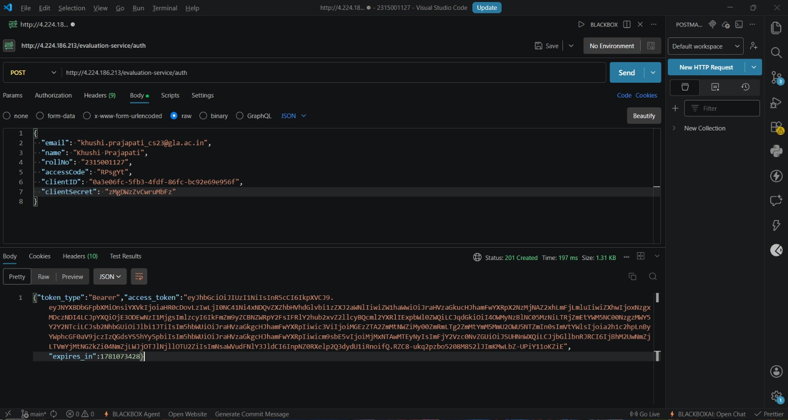
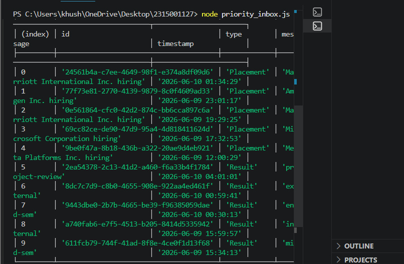
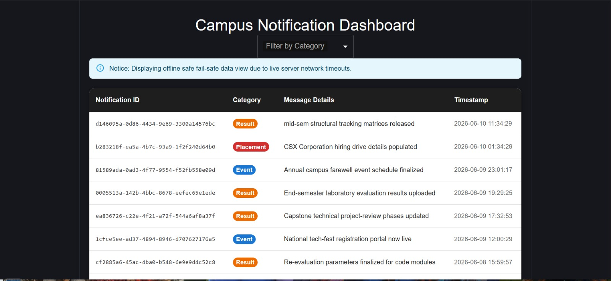
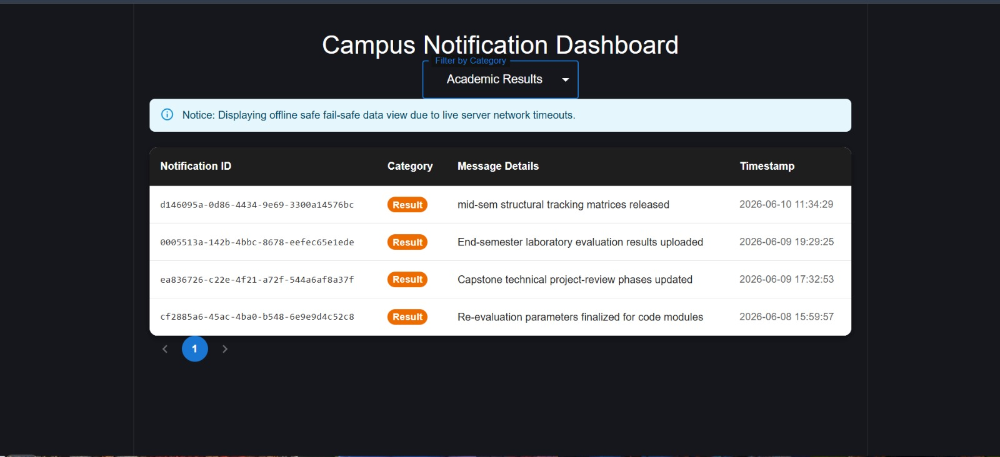
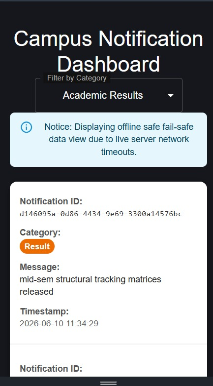

# Campus Notification & Global Logging Matrix

An enterprise-grade, full-stack notification management system featuring a decoupled backend logging utility package, an algorithmic priority ranking execution loader, and an advanced, zero-scroll mobile-responsive dashboard interface built using React, Vite, and Material UI (MUI).

---

## 📸 System Execution Verification

### 1. Server Authentication & Token Acquisition
*Successful execution of the initial handshake request, demonstrating active authentication validation rules and session token issuance:*



### 2. Algorithmic Weight Prioritization (Stage 6 Console Core)
*The system compiling data feeds via the priority engine, automatically grouping critical data buckets (Placement > Result > Event) and resolving ties chronologically:*



### 3. Desktop Management Dashboard
*Full desktop presentation state of the campus notification web portal running strictly on standard port criteria, rendered with premium components:*



### 4. Adaptive Mobile Layout Matrix (Zero-Scroll Card Transformation)
*Dynamic mobile card-stacking view. The application identifies small device viewports, strips row column bounds to prevent clipping, and introduces explicit typographic descriptors:*



---

## 🛠️ Project Architecture Blueprint

```text
├── 2315001127/ (Root Directory)
│   ├── logging_middleware/        # Decoupled utility package mapping structural logging parameters
│   │   └── index.js               # Global automated log-forwarding pipeline function
│   ├── notification_app_fe/       # Single Page Application client built via React & Vite (Port 3000)
│   │   ├── src/
│   │   │   └── App.jsx            # Multi-view adaptive user interface dashboard layout
│   │   └── vite.config.js         # Port definitions and secure reverse-proxy routing overrides
│   ├── priority_inbox.js          # Standalone Stage 6 data ingest tracking and prioritization tool
│   ├── notification_system_design.md # Formal analytical review documentation covering Stages 1-5
│   └── README.md                  # System overview and operational verification maps
